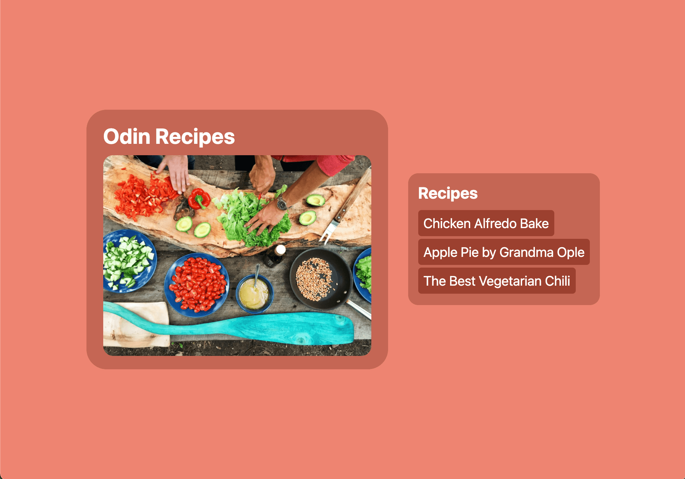
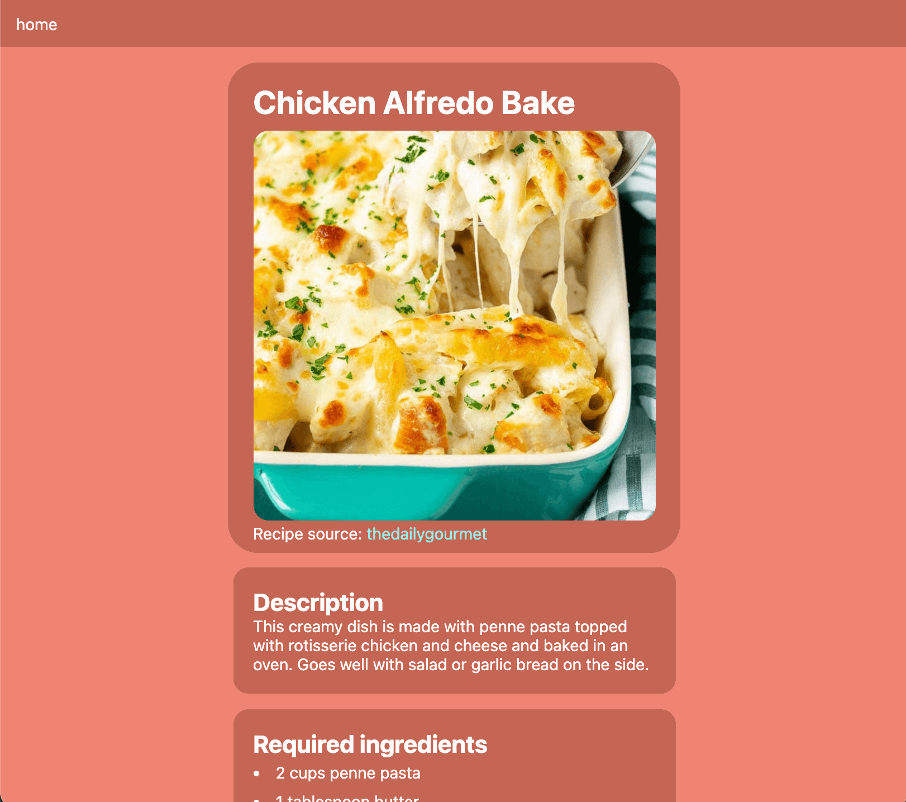
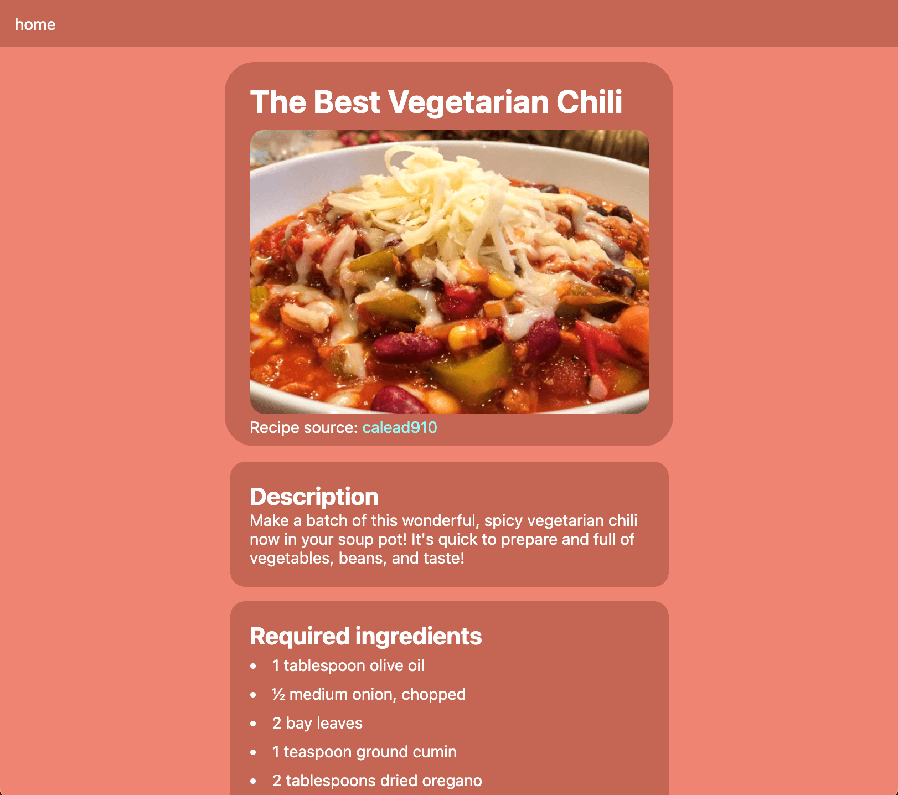
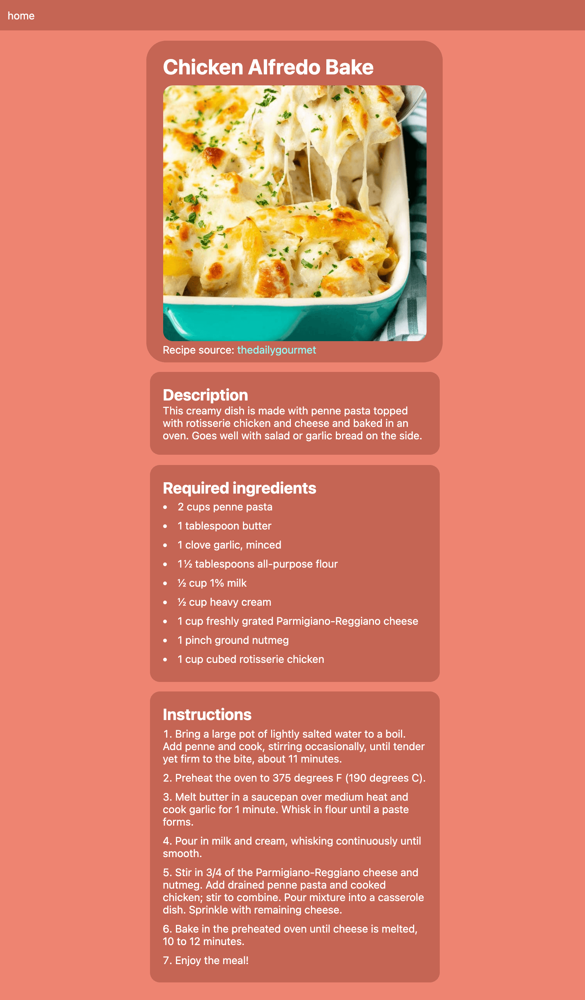
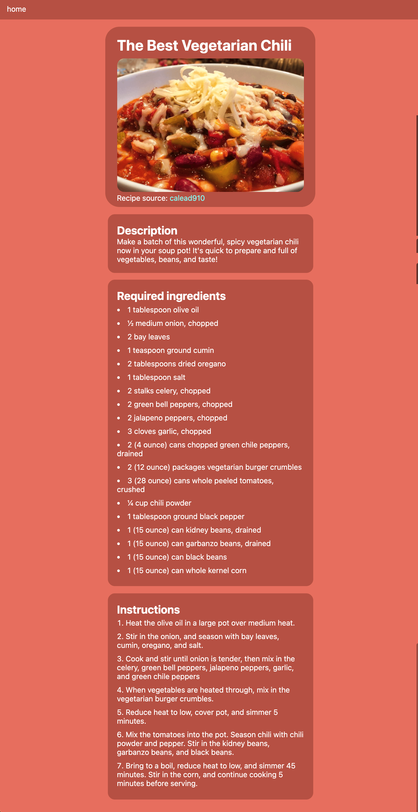

# Odin Recipes

This exercise is a part of the Odin Project fundamentals course. It is meant to demonstrate the basics of HTML such as:
- adding headings and paragraphs
- ordered and unordered lists
- absolute and relative linking using `<a href>`
- inserting images
- styling text using <strong>strong</strong>, <em>em</em>, etc

The will continue to be revised throughout the fundamentals course, where CSS and javascript will be added. By the end of the exercise, I will have learned how to:
1. Understand the structure of an html document, such as the included headers DOCTYPE, `<html>` tag, `<head>`, `<meta>`, `<link>`, `<body>`, and more.
2. Be able to structure a barebones web project by organizing other `.html` files and static assets as well as how to link to them by accessing child or parent directories in the `href`.

# Screenshots

  
   
  

Full recipe example 1             |  Full recipe example 2
:-------------------------:|:-------------------------:
  |  